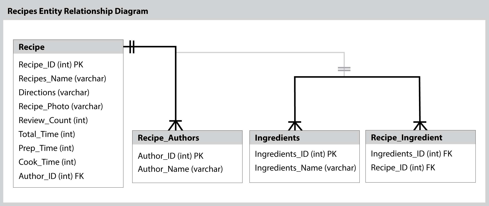

# SI507W19 Final Project

Angela Chih

[Link to this repository](https://github.com/ahcdesign/SI507W19FinalProject)

---

## Project Description

My project is called "QRecipes" as in Quick Recipes the Flask routes will have provided a list of recipes 
with a total prep time duration of less than 45 minutes and includes the total ingredients needed along with the 
direction of the recipes. As a Graduate student I would like the option to either meal prep or have a night in to 
de-stress but not take too long to cook/bake as I still have a lot of work to do. The main page 
of the Flask route will be the "Table of Contents" leading to 2 different Flask routes of providing the list of recipes
and another page to allow users to contribute recipes to add to the database.

## How to run

1. Install all requirements with `pip install -r requirements.txt`
2. Run `SI507project_tools.py runserver`

## How to use

1. A useful instruction goes here
2. A useful second step here
3. Understanding the database: 

## Routes in this application
- `/home` -> this is the home page containing a Table of Contents directing to two options.
- `/SuggestedQRecipes` -> This route will show a list of healthy recipes that can be prepped for a 
week, simple and fast to cook. It will also have a return button for accessibility to 
return to the homepage. 
- `/ContributedQRecipes` -> This route will allow the user to input recipes they have seen
online to be added into the database.

## How to run tests
1. First... (e.g. access a certain directory if necessary)
2. Second (e.g. any other setup necessary)
3. etc (e.g. run the specific test file)
NOTE: Need not have 3 steps, but should have as many as are appropriate!

## In this repository:
- Data
  - clean_recipes.csv
- ERDiagram_FinalProject.png
- README.md
- recipes_cleaned.csv
- SI507project_tests.py
- SI507project_tools.py

---
## Code Requirements for Grading
Please check the requirements you have accomplished in your code as demonstrated.
- [ ] This is a completed requirement.
- [x] This is an incomplete requirement.

Below is a list of the requirements listed in the rubric for you to copy and paste.  See rubric on Canvas for more details.

### General
- [x] Project is submitted as a Github repository
- [ ] Project includes a working Flask application that runs locally on a computer
- [ ] Project includes at least 1 test suite file with reasonable tests in it.
- [ ] Includes a `requirements.txt` file containing all required modules to run program
- [x] Includes a clear and readable README.md that follows this template
- [ ] Includes a sample .sqlite/.db file
- [x] Includes a diagram of your database schema
- [ ] Includes EVERY file needed in order to run the project
- [ ] Includes screenshots and/or clear descriptions of what your project should look like when it is working

### Flask Application
- [ ] Includes at least 3 different routes
- [ ] View/s a user can see when the application runs that are understandable/legible for someone who has NOT taken this course
- [x] Interactions with a database that has at least 2 tables
- [x] At least 1 relationship between 2 tables in database
- [x] Information stored in the database is viewed or interacted with in some way

### Additional Components (at least 6 required)
- [x] **Use of a new module**
- [ ] Use of a second new module
- [ ] Object definitions using inheritance (indicate if this counts for 2 or 3 of the six requirements in a parenthetical)
- [x] **A many-to-many relationship in your database structure**
- [x] **At least one form in your Flask application**
- [ ] Templating in your Flask application
- [x] **Inclusion of JavaScript files in the application**
- [x] **Links in the views of Flask application page/s**
- [ ] Relevant use of `itertools` and/or `collections`
- [ ] Sourcing of data using web scraping
- [ ] Sourcing of data using web REST API requests
- [x] **Sourcing of data using user input and/or a downloaded .csv or .json dataset**
- [ ] Caching of data you continually retrieve from the internet in some way

### Submission
- [ ] I included a link to my GitHub repository with the correct permissions on Canvas! (Did you though? Did you actually? Are you sure you didn't forget?)
- [ ] I included a summary of my project and how I thought it went **in my Canvas submission**!
